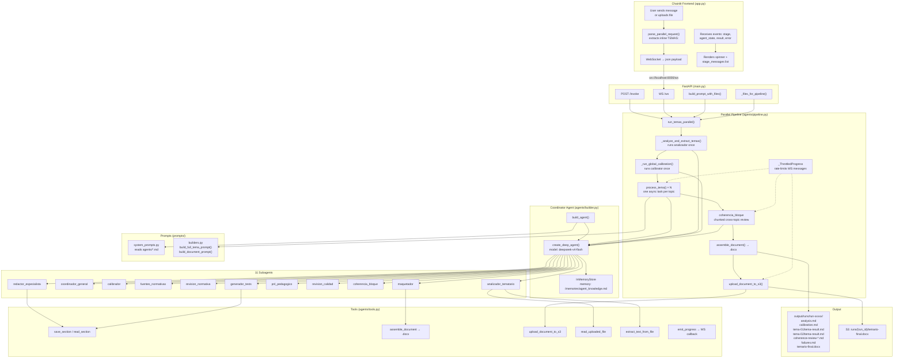

# OpoAgent System Architecture

```mermaid
flowchart TB
    subgraph frontend["Chainlit Frontend (app.py)"]
        U1["User sends message<br/>or uploads file"]
        U2["parse_parallel_request()<br/>extracts inline TEMAS:"]
        U3["WebSocket → json payload"]
        U4["Receives events: stage,<br/>agent_state, result, error"]
        U5["Renders spinner +<br/>stage_messages list"]
        U1 --> U2 --> U3
        U4 --> U5
    end

    subgraph api["FastAPI (main.py)"]
        A1["POST /invoke"]
        A2["WS /ws"]
        A3["build_prompt_with_files()"]
        A4["_files_for_pipeline()"]
    end

    subgraph pipeline["Parallel Pipeline (agents/pipeline.py)"]
        P1["run_temas_parallel()"]
        P2["_ThrottledProgress<br/>rate-limits WS messages"]
        P3["_analyze_and_extract_temas()<br/>runs analizador once"]
        P4["_run_global_calibration()<br/>runs calibrator once"]
        P5["process_tema() × N<br/>one async task per topic"]
        P6["coherencia_bloque<br/>chunked cross-topic review"]
        P7["assemble_document() → .docx"]
        P8["upload_document_to_s3()"]
    end

    subgraph agent["Coordinator Agent (agents/builder.py)"]
        B1["build_agent()"]
        B2["create_deep_agent()<br/>model: deepseek-v4-flash"]
        B3["InMemoryStore<br/>memory: /memories/agent_knowledge.md"]
    end

    subgraph subagents["11 Subagents"]
        direction LR
        S1["analizador_tematario"]
        S2["coordinador_general"]
        S3["calibrador"]
        S4["fuentes_normativas"]
        S5["revision_normativa"]
        S6["redactor_especialista"]
        S7["pnl_pedagogico"]
        S8["revision_calidad"]
        S9["coherencia_bloque"]
        S10["generador_tests"]
        S11["maquetador"]
    end

    subgraph tools["Tools (agents/tools.py)"]
        T1["save_section / read_section"]
        T2["assemble_document → .docx"]
        T3["upload_document_to_s3"]
        T4["read_uploaded_file"]
        T5["extract_text_from_file"]
        T6["emit_progress → WS callback"]
    end

    subgraph prompts["Prompts (prompts/)"]
        PR1["system_prompts.py<br/>reads agents/*.md"]
        PR2["builders.py<br/>build_full_tema_prompt()<br/>build_document_prompt()"]
    end

    subgraph output["Output"]
        O1["output/runs/run-xxxxx/<br/>analysis.md<br/>calibration.md<br/>tema-01/tema-result.md<br/>tema-02/tema-result.md<br/>coherence-review-*.md<br/>failures.md<br/>temario-final.docx"]
        O2["S3: runs/{run_id}/temario-final.docx"]
    end

    U3 -->|"ws://localhost:8000/ws"| A2
    A1 --> P1
    A2 --> P1
    A3 --> P1
    A4 --> P1

    P1 --> P3 --> P4 --> P5
    P5 --> P6 --> P7 --> P8
    P2 -.-> P5
    P2 -.-> P6
    P2 -.-> P8

    B1 --> B2 --> B3
    P5 --> B2
    P3 --> B2
    P4 --> B2
    P6 --> B2

    B2 --> S1 & S2 & S3 & S4 & S5 & S6 & S7 & S8 & S9 & S10 & S11

    S6 --> T1
    S10 --> T1
    S11 --> T2
    P8 --> T3
    S1 --> T4
    S1 --> T5

    B1 --> PR1
    P5 --> PR2

    P7 --> O1
    P8 --> O2
```
