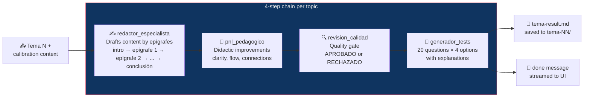

# Per-Tema Subagent Chain

Each topic goes through 4 sequential subagents (calibrator runs once globally).



## Parallelism model

```
Time ──────────────────────────────────────────►

Tema 01: [redactor    ][pnl][rev][tests]
Tema 02: [redactor    ][pnl][rev][tests]
Tema 03: [redactor    ][pnl][rev][tests]
Tema 04:             [redactor    ][pnl][rev]...
  ...
Tema 10:                                          [redactor]...
         ↑                                        ↑
     MAX_PARALLELISM concurrent                semaphore releases slot
```

Each column is one subagent call. Topics run in parallel (horizontally) but
subagents within a topic run sequentially (vertically).
