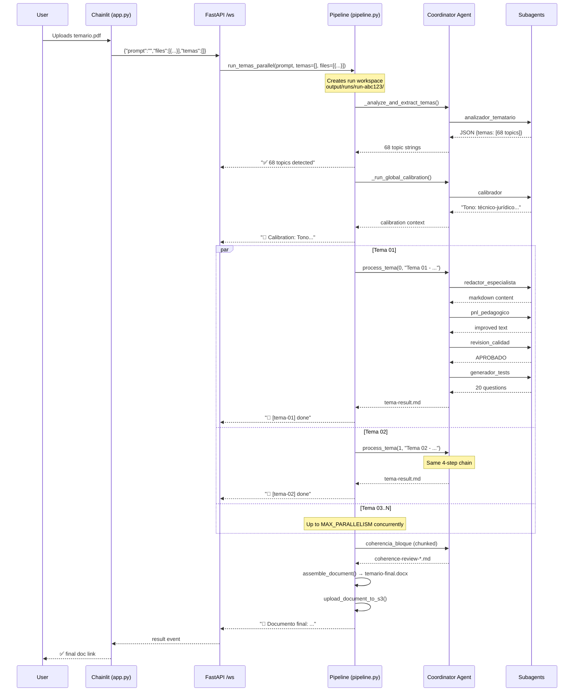

# Pipeline Sequence — File Upload to Final Document

```mermaid
sequenceDiagram
    participant U as User
    participant CL as Chainlit (app.py)
    participant WS as FastAPI /ws
    participant PL as Pipeline (pipeline.py)
    participant AG as Coordinator Agent
    participant SA as Subagents

    U->>CL: Uploads temario.pdf
    CL->>WS: {"prompt":"","files":[{...}],"temas":[]}
    WS->>PL: run_temas_parallel(prompt, temas=[], files=[{...}])

    Note over PL: Creates run workspace<br/>output/runs/run-abc123/

    PL->>AG: _analyze_and_extract_temas()
    AG->>SA: analizador_tematario
    SA-->>AG: JSON {temas: [68 topics]}
    AG-->>PL: 68 topic strings
    PL-->>WS: "✅ 68 topics detected"

    PL->>AG: _run_global_calibration()
    AG->>SA: calibrador
    SA-->>AG: "Tono: técnico-jurídico..."
    AG-->>PL: calibration context
    PL-->>WS: "🎯 Calibration: Tono..."

    par Tema 01
        PL->>AG: process_tema(0, "Tema 01 - ...")
        AG->>SA: redactor_especialista
        SA-->>AG: markdown content
        AG->>SA: pnl_pedagogico
        SA-->>AG: improved text
        AG->>SA: revision_calidad
        SA-->>AG: APROBADO
        AG->>SA: generador_tests
        SA-->>AG: 20 questions
        AG-->>PL: tema-result.md
        PL-->>WS: "🏁 [tema-01] done"
    and Tema 02
        PL->>AG: process_tema(1, "Tema 02 - ...")
        Note over AG: Same 4-step chain
        AG-->>PL: tema-result.md
        PL-->>WS: "🏁 [tema-02] done"
    and Tema 03..N
        Note over PL: Up to MAX_PARALLELISM concurrently
    end

    PL->>AG: coherencia_bloque (chunked)
    AG-->>PL: coherence-review-*.md

    PL->>PL: assemble_document() → temario-final.docx
    PL->>PL: upload_document_to_s3()
    PL-->>WS: "📄 Documento final: ..."
    WS-->>CL: result event
    CL-->>U: ✅ final doc link
```
